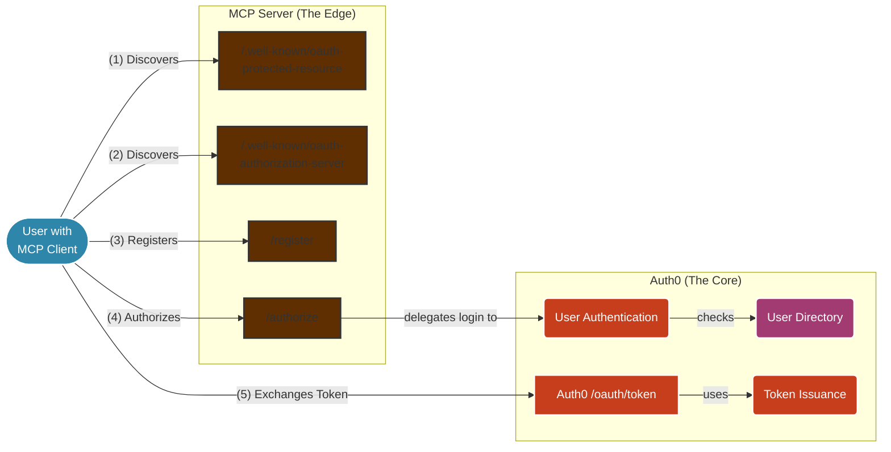

# Authentication Architecture and Flow

This document outlines the authentication architecture for the MCP server. The core design principle is that the **MCP server supports the authorization flow at the edge but delegates the core authorization and token issuance logic to Auth0.** The MCP server is an active participant in the authentication flow, but it is not the ultimate source of identity. It acts as a secure facade to a dedicated, robust identity provider.

## Architecture Overview

The following diagram illustrates the high-level system architecture. It shows how the user, through an MCP client, interacts with all the supporting MCP server endpoints, which in turn rely on Auth0 for core identity services.

-   **MCP Server (The Edge)**: This is the component that clients interact with directly. It exposes the necessary OAuth 2.0 endpoints but does not implement the core logic itself.
-   **Auth0 (The Core)**: This is our dedicated identity provider. It handles the heavy lifting of securely authenticating users, managing user profiles, and issuing cryptographically-signed access tokens.

## Authentication Flows

This server supports two primary OAuth 2.0 authorization flows, catering to different client types.

### 1. Native App / Public Client Flow (Authorization Code with PKCE)

This flow is designed for **public clients**, such as native desktop applications or single-page web apps, that cannot securely store a `client_secret`. It uses the Proof Key for Code Exchange (PKCE) extension to ensure security.

#### Message Flow

This sequence diagram shows the step-by-step process, including the initial discovery and registration steps required for a public client.

```mermaid
%%{init: {'theme':'base', 'themeVariables': { 'actorBkg': '#2E86AB', 'actorTextColor': '#fff', 'actorBorder': '#fff', 'c0': '#8B4513', 'c1': '#556B2F', 'c2': '#4682B4', 'c3': '#8B0000', 'actor0': '#2E86AB', 'actor1': '#8B4513', 'actor2': '#556B2F', 'actor3': '#8B0000', 'signalColor': '#ddd', 'signalTextColor': '#ddd', 'labelBoxBkgColor': '#444', 'labelTextColor': '#fff', 'loopTextColor': '#fff', 'noteTextColor': '#fff', 'noteBkgColor': '#555', 'noteBorderColor': '#777', 'activationBkgColor': '#666', 'activationBorderColor': '#888', 'sequenceNumberColor': '#fff' }}}%%
sequenceDiagram
    actor User
    participant Client as MCP Client
    participant Server as MCP Server (Edge)
    participant Auth0 as Auth0 (Core)

    User->>Client: 1. Start using the tool
    Client->>+Server: Initial request (unauthenticated)
    Server-->>-Client: 401 Unauthorized + WWW-Authenticate

    rect rgb(80, 60, 40)
        note over Client,Server: Discovery & Registration (Edge)
        Client->>+Server: GET /.well-known/oauth-protected-resource
        Server-->>-Client: Returns resource metadata
        Client->>+Server: GET /.well-known/oauth-authorization-server
        Server-->>-Client: Returns AS metadata
        Client->>+Server: POST /register
        Server-->>-Client: Returns client_id
    end

    rect rgb(70, 40, 40)
        note over Client,Auth0: Authorization Process (Core)
        Client->>+Server: Redirects user to /authorize
        Server->>+Auth0: Delegates login to Auth0
        User->>Auth0: Enters credentials & gives consent
        Auth0-->>-Client: Redirects user back with an authorization code
        Client->>+Auth0: Exchanges authorization code for token at Auth0 /oauth/token (with PKCE)
        Auth0-->>-Client: Issues secure Access Token directly
    end

    rect rgb(40, 60, 70)
        note over Client,Server: Authorized Access
        Client->>+Server: Makes request with Access Token
        Server-->>-Client: Grants access to resource
    end
```

#### Supporting Endpoints for Public Clients

For this flow, the MCP server provides several endpoints to facilitate discovery and registration:

-   **`/.well-known/oauth-protected-resource`**: Describes the protected API, its identifier (`audience`), and the location of the authorization server.
-   **`/.well-known/oauth-authorization-server`**: Describes the authorization server's capabilities, including its endpoints (`/authorize`, `/register`) and supported methods (PKCE, grant types).
-   **`/register`**: A mock Dynamic Client Registration (DCR) endpoint. Its sole purpose is to provide the pre-configured Auth0 `client_id` to the client, satisfying clients built to use DCR.

### 2. Cloud Connector / Confidential Client Flow (Authorization Code)

This flow is for **confidential clients**, such as a backend service for a cloud application (e.g., a Claude.ai integration). These clients can securely store a `client_id` and `client_secret` and authenticate themselves directly.

For this type of integration, the discovery and registration endpoints (`/register`, `/.well-known/*`) are **not used**. The client is pre-configured with its credentials and the necessary endpoint URLs.

#### Message Flow

This diagram shows the streamlined flow for a confidential client.

```mermaid
%%{init: {'theme':'base', 'themeVariables': { 'actorBkg': '#2E86AB', 'actorTextColor': '#fff', 'actorBorder': '#fff', 'c0': '#8B4513', 'c1': '#556B2F', 'c2': '#4682B4', 'c3': '#8B0000', 'actor0': '#2E86AB', 'actor1': '#8B4513', 'actor2': '#556B2F', 'actor3': '#8B0000', 'signalColor': '#ddd', 'signalTextColor': '#ddd', 'labelBoxBkgColor': '#444', 'labelTextColor': '#fff', 'loopTextColor': '#fff', 'noteTextColor': '#fff', 'noteBkgColor': '#555', 'noteBorderColor': '#777', 'activationBkgColor': '#666', 'activationBorderColor': '#888', 'sequenceNumberColor': '#fff' }}}%%
sequenceDiagram
    actor User
    participant Connector as Cloud Connector (Backend)
    participant Server as MCP Server (Edge)
    participant Auth0 as Auth0 (Core)

    User->>Connector: 1. User clicks "Connect Account" in cloud service
    
    rect rgb(70, 40, 40)
        note over User, Auth0: Authorization Process
        Connector->>+Server: 2. Redirects user's browser to /authorize
        Server->>+Auth0: 3. Delegates login, injecting 'audience'
        User->>Auth0: 4. Authenticates & grants consent
        Auth0-->>-Connector: 5. Redirects back to Connector with authorization_code
        
        note over Connector, Auth0: Token Exchange (Server-to-Server)
        Connector->>+Auth0: 6. Exchanges code for token <br> (Authenticates with client_id & client_secret)
        Auth0-->>-Connector: 7. Issues Access & Refresh Tokens to Connector backend
    end

    rect rgb(40, 60, 70)
        note over Connector,Server: Authorized API Access
        Connector->>+Server: 8. Makes API calls on behalf of the user
        Server-->>-Connector: 9. Grants access to protected resources
    end
```

## Shared Endpoint: `/authorize`

The `/authorize` endpoint is a crucial component shared by both flows. It acts as a lightweight proxy in front of Auth0's Universal Login page.

**Necessity and Function:**

1.  **Injects the `audience` Parameter**: Its primary role is to inject the `audience` parameter into the authorization request. This tells Auth0 which specific API the client is trying to access. This abstraction simplifies client configuration for both public and confidential clients.
2.  **Enforces Scopes**: It can programmatically ensure that required scopes are included in the request sent to Auth0, centralizing security policy.
3.  **Abstracts the Identity Provider**: It receives the request at a local URL and redirects to the actual Auth0 tenant URL, hiding the specifics of the identity provider from the client.

## Security Considerations

1.  **Redirect URI Validation**: The most critical risk in this flow is weak `redirect_uri` validation. The server at the `/authorize` endpoint *must* strictly validate that the `redirect_uri` in the request exactly matches one of the URIs pre-registered for that `client_id`. Failure to do so could allow an attacker to have the authorization code sent to a malicious site.
2.  **Confidential Client Secret Protection**: For the cloud connector flow, the `client_secret` must be protected on the connector's backend. If compromised, an attacker could impersonate the connector.
3.  **Dynamic Client Registration (DCR) Security**: If the `/register` endpoint is open and not properly secured, it could potentially be a vector for attack (e.g., allowing malicious clients to register). In the current flow, it is used to hand out a pre-existing configuration, which is safer. For production, access to this endpoint should be restricted.
4.  **Token Exchange Security**: The public client flow is secured by PKCE. The confidential client flow is secured by the `client_secret`. Both rely on secure, direct HTTPS communication with Auth0 for the token exchange. 