# Continuous Learning: MCP OAuth Server with Auth0

This document captures critical lessons learned during the implementation of an MCP (Model Context Protocol) OAuth server with Auth0 integration.

## Overview

Successfully implemented an MCP OAuth server that:
- Serves OAuth metadata locally with CORS support
- Proxies authorization and token requests to Auth0
- Supports Dynamic Client Registration (DCR)
- Works with MCP Inspector for testing
- Properly handles API scopes and permissions

## Key Technical Challenges & Solutions

### 1. Auth0 Native Application API Scope Issues

**Problem**: Native applications using Authorization Code + PKCE flow were not receiving API scopes in tokens, only getting `"scope": "openid profile"` and `"permissions": []` despite correct OAuth flow implementation.

**Root Cause**: Auth0 requires users to have explicit permissions assigned through roles for Native applications to receive API scopes in tokens.

**Solution**: 
1. Create a role with API permissions
2. Assign the role to users
3. Enable proper API configuration

```bash
# Create role
auth0 roles create --name "Trading User" --description "User with trading API access"

# Add API permissions to role  
auth0 roles permissions add <role-id> --api-id <api-id> --permissions read:data,write:data,execute:trades

# Assign role to user
auth0 users roles assign "<user-id>" --roles <role-id>
```

**Critical Learning**: Client grants do NOT work for Native applications - they only work for Machine-to-Machine applications. Native apps require role-based permissions.

### 2. MCP Inspector Callback URL Hardcoding

**Problem**: MCP Inspector ignores DCR response redirect URIs and hardcodes `http://localhost:**6274**/oauth/callback`.

**Solution**: Configure Auth0 application with the hardcoded callback URL rather than trying to configure it through DCR.

**Learning**: Some OAuth clients have hardcoded behaviors that override standard OAuth flows.

### 3. CORS Issues with Direct Auth0 Access

**Problem**: MCP Inspector couldn't fetch OAuth metadata directly from Auth0 due to CORS restrictions.

**Solution**: Implement OAuth metadata discovery endpoints with CORS headers:
- `/.well-known/oauth-protected-resource`
- `/.well-known/oauth-authorization-server` 
- `/register` (DCR endpoint)

### 4. Auth0 API Configuration Requirements

**Critical Auth0 API Settings**:
```json
{
  "enforce_policies": true,
  "token_dialect": "access_token_authz",
  "skip_consent_for_verifiable_first_party_clients": false,
  "allow_offline_access": true
}
```

**Learning**: 
- `enforce_policies: true` is required for RBAC to work
- `token_dialect: "access_token_authz"` ensures proper token format
- `skip_consent_for_verifiable_first_party_clients: false` forces consent screen for API scopes

### 5. OAuth Flow Implementation

**Architecture**: Server handles authorization flow with direct Auth0 token exchange:

```javascript
// Authorization proxy - adds audience parameter and redirects to Auth0
app.get('/authorize', (req, res) => {
  const authUrl = new URL('https://tenant.auth0.com/authorize');
  // Copy all query parameters
  Object.entries(req.query).forEach(([key, value]) => {
    authUrl.searchParams.set(key, value);
  });
  // Add audience for API access
  authUrl.searchParams.set('audience', 'https://api.example.com');
  res.redirect(authUrl.toString());
});

// Clients exchange tokens directly with Auth0
// Clients must include audience parameter in their token requests to:
// POST https://tenant.auth0.com/oauth/token
```

## Auth0 Configuration Checklist

### API Configuration
- [ ] Create API with proper identifier (audience)
- [ ] Define all required scopes
- [ ] Set `enforce_policies: true`
- [ ] Set `token_dialect: "access_token_authz"`
- [ ] Set `skip_consent_for_verifiable_first_party_clients: false`
- [ ] Enable `allow_offline_access: true` if refresh tokens needed

### Application Configuration  
- [ ] Create Native application (not Machine-to-Machine)
- [ ] Configure callback URLs (including MCP Inspector's hardcoded URL)
- [ ] Set allowed origins for CORS
- [ ] Enable Authorization Code + PKCE grant type

### Role-Based Access Control
- [ ] Create roles for different user types
- [ ] Add API permissions to roles using CLI: `auth0 roles permissions add`
- [ ] Assign roles to users: `auth0 users roles assign`

### Testing Verification
- [ ] DCR request includes all required scopes
- [ ] Authorization request includes `audience` parameter
- [ ] Token request includes `audience` parameter  
- [ ] Token response includes API scopes in `scope` field
- [ ] Token response includes API permissions in `permissions` array

## Common Pitfalls

1. **Client Grants Confusion**: Don't try to use client grants for Native applications - they only work for M2M flows.

2. **Missing Audience Parameter**: Auth0 requires `audience` parameter in authorization and token requests to include API scopes.

3. **Role Assignment**: Users must have roles with API permissions assigned, not just application access.

4. **CORS Configuration**: Auth0 doesn't serve OAuth metadata with CORS headers, requiring discovery endpoint proxy.

5. **Consent Screen**: Disabling consent can prevent API scopes from being requested properly.

## Debugging Tools

### Comprehensive HTTP Logging
Implemented detailed request/response logging for all endpoints:
- Request correlation with unique IDs
- Complete header and body logging  
- Response duration tracking
- Outbound Auth0 API request/response logging

### Auth0 CLI Commands
```bash
# Verify API configuration
auth0 apis show <api-id> --json

# Check user roles
auth0 users show "<user-id>" --json

# List role permissions
auth0 roles permissions list <role-id>

# Test token contents (decode JWT)
echo "<jwt-token>" | base64 -d
```

### Token Verification
Always verify token contents contain:
- Correct `aud` (audience) array including API identifier
- All requested scopes in `scope` field
- All user permissions in `permissions` array

## Success Metrics

✅ **Working OAuth Flow**:
- DCR returns client configuration with all scopes
- Authorization includes API audience parameter
- Token response includes: `"scope": "openid profile read:data write:data execute:trades"`
- Token response includes: `"permissions": ["read:data", "write:data", "execute:trades"]`

✅ **MCP Inspector Integration**:
- Successfully registers client via DCR
- Completes authorization flow with consent screen showing API scopes
- Receives access token with API permissions
- Can make authenticated requests to protected resources

## Future Considerations

1. **User Management**: Implement automated role assignment for new users
2. **Scope Management**: Dynamic scope requests based on client needs
3. **Token Refresh**: Implement refresh token handling for long-lived sessions
4. **Error Handling**: Enhanced error responses for OAuth failures
5. **Security**: Rate limiting and additional validation for production use

## References

- [Auth0 Authorization Code + PKCE Flow](https://auth0.com/docs/get-started/authentication-and-authorization-flow/authorization-code-flow-with-proof-key-for-code-exchange-pkce)
- [Auth0 Role-Based Access Control](https://auth0.com/docs/manage-users/access-control/rbac)
- [MCP OAuth Specification](https://spec.modelcontextprotocol.io/specification/server/authentication/)
- [OAuth 2.0 Dynamic Client Registration](https://tools.ietf.org/html/rfc7591) 

## OAuth MCP Server - Continuous Learning Log

## Knowledge Base Updates

### 2024-12-28: OAuth MCP Server Initial Setup
**Context**: Started development of OAuth-enabled MCP (Model Context Protocol) server
**Key Learning**: Understanding the MCP protocol basics and OAuth integration patterns

### 2024-12-28: HTTP Transport Configuration
**Context**: Implementing HTTP transport layer for OAuth
**Key Learning**: HTTP transport requires session management, unlike stdio transport

### 2024-12-29: Deep Dive into Resource Subscription Architecture
**Context**: Understanding how resource subscriptions work in practice
**Key Learning**: Resource subscriptions require both HTTP transport and proper session management

## 🎯 **Ground Truth: Streamable Resources in MCP - Complete Flow Analysis**

*Based on detailed examination of both our implementation and the official TypeScript SDK*

### 📋 **Executive Summary**

**❌ Common Misconception**: Each resource stream creates its own SSE session  
**✅ Ground Truth**: ALL resource streams share ONE SSE session per client connection

### 🔍 **Key Architecture Components**

1. **HTTP Transport Layer**: Manages SSE sessions (`StreamableHTTPServerTransport`)
2. **Session Manager**: Maps session IDs to transport instances (`Map<string, Transport>`)
3. **MCP Protocol Layer**: Handles resource subscriptions and notifications
4. **Resource Manager**: Maintains subscription callbacks and timers

### 🌊 **Detailed Message Flow Analysis**

#### **Phase 1: 🎯 Initialize (Creates SSE Session)**
```
Client → Server: POST /mcp
Headers: { Accept: "application/json, text/event-stream" }
Body: { method: "initialize", params: {...} }

Server Response:
Headers: { mcp-session-id: "abc-123-def" }
Body: { result: { capabilities: { resources: { subscribe: true } } } }
```

**Critical Points:**
- SSE session is created during `initialize` request (NOT before subscribe)
- Server returns session ID in response headers
- One session ID per client connection

#### **Phase 2: 🌐 Open SSE Stream**
```
Client → Server: GET /mcp
Headers: { 
  mcp-session-id: "abc-123-def",
  Accept: "text/event-stream"
}

Server Response:
Headers: { 
  Content-Type: "text/event-stream",
  Cache-Control: "no-cache"
}
Body: [SSE stream remains open]
```

#### **Phase 3: 🔗 Subscribe to Resources**
```
Client → Server: POST /mcp (via same session)
Headers: { mcp-session-id: "abc-123-def" }
Body: {
  method: "resources/subscribe",
  params: { uri: "stream://market/AAPL" }
}

Server → Client: HTTP 200 OK
Body: { result: {} }
```

#### **Phase 4: 📊 Stream Updates (Multiple Resources)**
```
# Resource 1 Update (AAPL)
Server → Client: (via SSE stream)
data: {
  "jsonrpc": "2.0",
  "method": "notifications/resources/updated",
  "params": { "uri": "stream://market/AAPL" }
}

# Resource 2 Update (GOOGL) - SAME SSE SESSION
Server → Client: (via SSE stream)
data: {
  "jsonrpc": "2.0", 
  "method": "notifications/resources/updated",
  "params": { "uri": "stream://market/GOOGL" }
}
```

#### **Phase 5: 🔚 Unsubscribe & Cleanup**
```
Client → Server: POST /mcp
Body: {
  method: "resources/unsubscribe", 
  params: { uri: "stream://market/AAPL" }
}

Server: Stops sending updates for that specific URI
SSE Session: Remains open for other resources
```

### 🆔 **How Multiple Streams Are Identified in Same SSE Session**

**CORRECTED**: Different streams use different mechanisms for requests vs notifications:

#### **📤 Subscribe/Unsubscribe Requests (Use Request IDs)**
Each request gets a unique **Request ID** for JSON-RPC correlation:
```typescript
// Subscribe request
{
  "jsonrpc": "2.0", 
  "id": "req-123",          // ← Request ID for correlation
  "method": "resources/subscribe", 
  "params": { "uri": "stream://market/AAPL" }
}

// Response
{
  "jsonrpc": "2.0",
  "id": "req-123",          // ← Same Request ID in response
  "result": {}
}
```

#### **📥 Stream Update Notifications (Use URIs)**
Update notifications identify streams by **URI** (no request ID - they're one-way):
```typescript
// From TypeScript SDK types.ts:610-620
export const ResourceUpdatedNotificationSchema = NotificationSchema.extend({
  method: z.literal("notifications/resources/updated"),
  params: BaseNotificationParamsSchema.extend({
    /**
     * The URI of the resource that has been updated. 
     * This might be a sub-resource of the one that the client actually subscribed to.
     */
    uri: z.string(),    // ← URI identifies which resource stream
  }),
});
```

#### **🌊 Multiple Streams in One Session**
Different resource streams coexist using their unique URIs:
```typescript
// Our implementation (src/capabilities/resources.ts:175-185)
const interval = setInterval(() => {
    console.log(`[Resources] Sending update for: ${uri}`);
    server.server.sendResourceUpdated({ uri }); // URI identifies the specific stream
}, 2000);

// Results in notifications like:
// { method: "notifications/resources/updated", params: { uri: "stream://market/AAPL" } }
// { method: "notifications/resources/updated", params: { uri: "stream://market/GOOGL" } }
```

**Key Distinction**: 
- **Request ID** = Used for JSON-RPC request/response correlation
- **URI** = Used to identify which resource stream the notification belongs to

### 🏗️ **Implementation Architecture**

#### **Session Management (src/transports/http.ts:19)**
```typescript
private sessions = new Map<string, StreamableHTTPServerTransport>();
```

#### **Subscription Tracking (src/capabilities/resources.ts:12)**
```typescript
const subscriptions = new Map<string, NodeJS.Timeout>();
```

#### **Stream Identification Process**
1. **Subscribe**: Client sends `resources/subscribe` with specific `uri`
2. **Track**: Server maps `uri` to interval timer
3. **Stream**: Server sends updates with same `uri` in notification
4. **Identify**: Client matches notification `uri` to subscription
5. **Unsubscribe**: Client sends `resources/unsubscribe` with specific `uri`

### 🎨 **Complete Colorful Message Flow Diagram**

```mermaid
%%{init: {'theme':'dark', 'themeVariables': {'primaryColor':'#ff6b6b', 'primaryTextColor':'#ffffff', 'primaryBorderColor':'#ff6b6b', 'lineColor':'#ffa726', 'sectionBkgColor':'#1a1a1a', 'altSectionBkgColor':'#2d2d2d', 'gridColor':'#444444', 'secondaryColor':'#4ecdc4', 'tertiaryColor':'#45b7d1'}}}%%
sequenceDiagram
    participant C as 🖥️ Client
    participant H as 🌐 HTTP Transport
    participant T as 🔄 StreamableHTTPTransport
    participant S as 🚀 MCP Server
    participant RM as 📊 Resource Manager
    
    Note over C,RM: 🎯 GROUND TRUTH: Single SSE Session Per Client Connection
    
    rect rgb(15, 25, 45)
    Note over C,RM: Phase 1: Initialize - Creates One SSE Session
    C->>H: 📤 POST /mcp<br/>Accept: application/json, text/event-stream<br/>Body: { method: "initialize", ... }
    
    H->>T: 🆕 new StreamableHTTPServerTransport()<br/>sessionIdGenerator: () => randomUUID()
    
    T->>T: 🎲 Generate sessionId<br/>sessionId = "abc-123-def"
    
    T->>T: 🔧 Set _initialized = true<br/>_standaloneSseStreamId = "_GET_stream"
    
    T->>H: 🔔 onsessioninitialized(sessionId)<br/>sessions.set(sessionId, transport)
    
    H->>S: 🚀 Create OAuthMcpServer<br/>server.connect(transport)
    
    S->>C: 📥 HTTP 200 OK<br/>mcp-session-id: "abc-123-def"<br/>Body: { result: { capabilities: {...} } }
    end
    
    rect rgb(45, 25, 15)
    Note over C,RM: Phase 2: Open SSE Stream (One Stream for All Resources)
    C->>H: 🌊 GET /mcp<br/>mcp-session-id: "abc-123-def"<br/>Accept: text/event-stream
    
    H->>T: 🔍 Lookup session by ID<br/>sessions.get("abc-123-def")
    
    T->>T: 🔧 Setup SSE response<br/>Content-Type: text/event-stream<br/>Cache-Control: no-cache
    
    T->>C: 📡 SSE Stream Established<br/>[Connection remains open]
    end
    
    rect rgb(15, 45, 15)
    Note over C,RM: Phase 3: Subscribe to Multiple Resources (Same Session)
    C->>S: 📤 POST /mcp<br/>mcp-session-id: "abc-123-def"<br/>{ method: "resources/subscribe",<br/>  params: { uri: "stream://market/AAPL" } }
    
    S->>RM: 🔍 Lookup subscription callback<br/>onSubscribe("stream://market/AAPL")
    
    RM->>RM: ⏰ Start timer for AAPL<br/>setInterval(() => sendUpdate("AAPL"), 2000)
    
    S->>C: ✅ { result: {} }
    
    C->>S: 📤 POST /mcp (SAME SESSION)<br/>mcp-session-id: "abc-123-def"<br/>{ method: "resources/subscribe",<br/>  params: { uri: "stream://market/GOOGL" } }
    
    RM->>RM: ⏰ Start timer for GOOGL<br/>setInterval(() => sendUpdate("GOOGL"), 2000)
    
    S->>C: ✅ { result: {} }
    end
    
    rect rgb(45, 15, 45)
    Note over C,RM: Phase 4: Stream Updates (URI Identifies Each Stream)
    loop Every 2 seconds
        RM->>S: 🔔 sendResourceUpdated({ uri: "stream://market/AAPL" })
        S->>T: 📊 Send notification via SSE
        T->>C: 📡 data: {<br/>  "method": "notifications/resources/updated",<br/>  "params": { "uri": "stream://market/AAPL" }<br/>}
        
        RM->>S: 🔔 sendResourceUpdated({ uri: "stream://market/GOOGL" })
        S->>T: 📊 Send notification via SSE  
        T->>C: 📡 data: {<br/>  "method": "notifications/resources/updated",<br/>  "params": { "uri": "stream://market/GOOGL" }<br/>}
    end
    end
    
    rect rgb(45, 15, 15)
    Note over C,RM: Phase 5: Unsubscribe (Selective by URI)
    C->>S: 📤 POST /mcp<br/>mcp-session-id: "abc-123-def"<br/>{ method: "resources/unsubscribe",<br/>  params: { uri: "stream://market/AAPL" } }
    
    S->>RM: 🛑 onUnsubscribe("stream://market/AAPL")
    RM->>RM: ⏹️ Stop timer for AAPL<br/>clearInterval(appleTimer)
    
    S->>C: ✅ { result: {} }
    
    Note over T: 🌊 SSE Session Remains Open<br/>GOOGL updates continue
    
    C->>H: 🔚 Close SSE connection<br/>or client disconnects
    H->>RM: 🧹 Cleanup all subscriptions<br/>clearInterval(all timers)
    end
```



### 💡 **Key Technical Insights**

#### **1. Session Lifecycle**
- **Creation**: During `initialize` request
- **Duration**: Until client closes SSE connection or server shuts down
- **Scope**: One session per client, multiple resources per session

#### **2. Resource Stream Multiplexing**
- **Method**: All streams use same SSE connection
- **Identification**: `uri` parameter in notification messages
- **Isolation**: Each resource has independent subscription timer

#### **3. Error Handling & Cleanup**
```typescript
// From our implementation (src/capabilities/resources.ts:195-203)
onUnsubscribe: (uri: string) => {
    console.log(`[Resources] Client UNsubscribed from: ${uri}`);
    if (subscriptions.has(uri)) {
        clearInterval(subscriptions.get(uri));
        subscriptions.delete(uri);
        console.log(`[Resources] Stopped streaming for: ${uri}`);
    }
}
```

### 🎯 **Best Practices Learned**

1. **Always use URI to identify specific streams** in shared SSE session
2. **Implement proper cleanup** for subscription timers on unsubscribe
3. **Session management is transport-layer concern**, not protocol-layer
4. **One SSE session can efficiently handle multiple resource streams**
5. **Notifications must include specific URI** for client-side routing

---

## Implementation Challenges and Solutions 